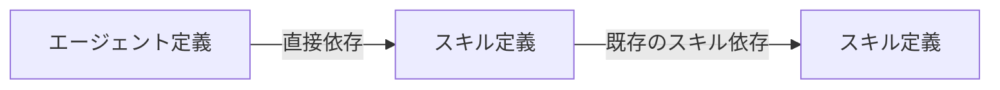

# カスタムエージェント配布基盤設計

## 文書の目的

この文書は、Agent Skills にカスタムエージェントの生成、配布、導入、更新、削除、診断を追加するための設計契約を定める。読者は Agent Skills の実装者、レビュー担当者、および Agent Skills を採用する製品の実装者である。

この文書が正本として定める範囲は、ソース定義、生成パッケージ、依存解決、実行ホストとの境界、コマンドの意味、導入状態の所有、および段階的な実装範囲である。個々のカスタムエージェントが担う成果責務や、Supervisor と Orchestrator の進行規則は、各製品が所有する定義であり、この基盤では定めない。

設計状態は実装前の Draft とする。

## 設計判断

1. カスタムエージェントの意味は、実行ホストに依存しないエージェント定義を正本とする。
2. モデル、推論強度、サンドボックス、ツール、ホスト固有機能は、エージェント定義とは別のホストバインディングで定める。
3. 依存方向は `agent -> skill` の一方向だけを許可する。`skill -> agent` と `agent -> agent` は配布依存として扱わない。
4. エージェントが要求するスキルは、既存のスキル依存グラフへ接続する。異種成果物を任意に結ぶ汎用依存グラフは導入しない。
5. スキルとエージェントは一つのカタログバンドルとして一度に生成する。生成コマンドを成果物種別ごとに分けない。
6. 利用時の操作は `skills` と `agents` のコマンド群へ分ける。`agents` の導入系操作は、必要なスキルの推移的依存を同時に解決する。
7. ホストアダプターを追加しても、既存の全エージェントへ新しいホストバインディングを強制しない。選択したエージェントが要求されたホストをサポートするかを操作時に検証する。
8. ホスト全体の共有設定は初期実装で書き換えない。エージェント単位で所有できる成果物と導入状態だけを管理対象にする。

## 用語と所有者

| 用語 | 指す対象 | 所有者 |
| --- | --- | --- |
| カタログバンドル | 同じ `catalogId` と `bundleVersion` で配布するスキルとエージェントの集合 | 採用製品 |
| スキル定義 | スキルのメタデータ、本文、参照、スキル依存 | 採用製品 |
| エージェント定義 | エージェントの識別子、説明、成果責務、入出力、境界、完了条件、失敗条件、スキル依存 | 採用製品 |
| ホストバインディング | 一つのエージェントを特定の実行ホストで動かすためのモデル、権限、機能などの設定 | 採用製品。ただし入力スキーマはホストアダプター |
| 正規パッケージ | ソース定義から決定論的に生成された、導入前の配布単位 | Agent Skills |
| ホスト成果物 | 正規パッケージとホストバインディングから生成され、実行ホストが読み取るファイル | ホストアダプター |
| ホストアダプター | ホストバインディングの検証、ホスト成果物への変換、導入先、所有状態、衝突判定を提供する実装 | Agent Skills |
| 導入状態 | Agent Skills が所有するエージェント成果物、導入時の digest、カタログ、導入先を記録した状態 | Agent Skills。物理配置はホストアダプター |

ここでいう実行ホストは Codex、Claude Code など、エージェントを読み込んで実行する製品を指す。Agent Skills のコマンド群を組み込む製品 CLI とは別の対象である。

## 責務の境界

### 採用製品が所有するもの

- 配布するエージェントの名称、分類、説明、成果責務、指示。
- エージェントが直接要求するスキル。
- 各エージェントを対応させる実行ホストと、そのホストバインディング。
- カタログのリリース時期と `bundleVersion`。
- 製品 CLI 上のコマンドルート、出力形式、既定の対象範囲。

### Agent Skills が所有するもの

- ソース定義と生成パッケージのスキーマ。
- パス、名称、依存関係、参照、digest の検証。
- 決定論的な生成と `--check`。
- エージェント選択とスキル依存閉包の解決。
- ホストアダプターの契約。
- export、install、update、uninstall、prune、doctor の計画と実行。
- 管理対象と未管理対象を区別する所有状態、衝突、変更差分の判定。

### ホストアダプターが所有するもの

- ホスト識別子と、対応するホストバインディングの入力契約。
- ホスト固有設定の既定値、許容値、必須条件。
- ホスト成果物のファイル形式、出力パス、予約名、上書き規則。
- project scope と user scope の導入先解決。
- 実行ホストが探索しない安全な導入状態の配置、または同等の所有識別方法。
- 導入後に必要な再読み込みの案内。

ホストアダプターはエージェントの成果責務やスキル依存を書き換えない。正規パッケージが表す意味を、ホストが読み取れる形式へ変換する。

## 依存関係

### 許可する関係



- スキルは、同じカタログバンドル内の別のスキルへ依存できる。
- エージェントは、同じカタログバンドル内のスキルへ直接依存できる。
- エージェントを選択した操作は、直接依存するスキルを根として、既存のスキル依存グラフから推移的閉包を求める。

### 許可しない関係

- スキルからエージェントへの依存。
- エージェントから別のエージェントへの配布依存。
- 別カタログへの依存。
- 任意種別を値で切り替える `ArtifactDependency { kind, name }` のような汎用依存。
- 任意依存、条件付き依存、個別のバージョン制約。

これらを禁止するため、`skill.json` は既存の `dependencies` だけを持ち、`agent.json` は `skillDependencies` だけを持つ。エージェント依存を表すフィールドや解決器は作らない。

### 参照と依存宣言の整合

`AGENT.md.template` で同じバンドルのスキルを `$<skill-name>` として参照する場合、その名前を `skillDependencies` に宣言する。宣言したスキルも、本文内で同じ形式により参照する。この照合規則は既存のスキル定義と同じにする。

`$<skill-name>` は Agent Skills の正規参照構文であり、すべての実行ホストが同じ構文を直接解釈するという意味ではない。エージェント用ホストアダプターは、実行ホストがこの構文を解釈できる場合は保持し、異なる参照方法を要求する場合は意味を保って変換する。

依存宣言が正本であり、一般的な文章中の単語から依存関係を推定しない。スキル定義にはエージェント依存を宣言する面が存在しないため、配布基盤の構造から `skill -> agent` を作れない。

### オーケストレーションとの境界

Orchestrator が「設計」「実装」「検証」などの成果責務を実行者へ割り当てることは、実行時のルーティングである。Orchestrator スキルが `architect` や `implementer` へ配布依存することではない。

実行ホストは、利用可能なエージェントから要求された成果責務に対応する実行者を選ぶ。必要な実行能力が存在しない場合は、実行時の能力不足として扱う。エージェント一式を同時に導入したい要求が生じても、実在しない依存を追加せず、製品側の選択単位または将来の明示的な導入プロファイルとして扱う。

## ソース定義

### バンドル構成

スキルとエージェントを含むソーススキーマ v2 は、次の固定深度を使う。

```text
<bundle-root>/
  bundle.json
  definitions/
    skills/
      <category>/
        <skill-name>/
          skill.json
          SKILL.md.template
          references/
            <reference-name>.md.template
    agents/
      <category>/
        <agent-name>/
          agent.json
          AGENT.md.template
          hosts/
            <host-id>.json
  generated/
```

`<bundle-root>` の実際のディレクトリ名は契約に含めない。既存製品が `skills` を維持しても、新しく `agent-assets` などを選んでもよい。

`definitions/skills` と `definitions/agents` の category は別の名前空間である。skill name は全スキル間、agent name は全エージェント間で一意にする。スキルとエージェントは依存フィールドの型が異なるため、両者が同じ名前を持つこと自体は衝突としない。

`definitions/skills` と `definitions/agents` は、定義を持つ成果物種別についてだけ配置する。少なくとも一方に一つ以上の定義が必要であり、存在する category は一つ以上の定義を持つ。各エージェント定義には `agent.json`、`AGENT.md.template`、一つ以上のホストバインディングが必要である。

### `bundle.json`

スキーマ v2 は、スキルとエージェントの両方を覆う版として `bundleVersion` を持つ。

```json
{
  "schemaVersion": 2,
  "catalogId": "com.example.agent-assets",
  "bundleVersion": 1
}
```

| プロパティ | 契約 |
| --- | --- |
| `schemaVersion` | 値は `2`。ソースレイアウトとバンドル契約を選択する。 |
| `catalogId` | ソース、生成物、導入状態で共有する安定したカタログ識別子。 |
| `bundleVersion` | スキルとエージェントをまとめた配布版。1 以上の整数。 |

スキーマ v1 の `skillBundleVersion` はスキル専用契約として意味を変えずに維持する。スキーマ v2 では、意味が異なる値を別名の互換フィールドとして併存させない。

### `skill.json`

スキーマ v2 でも、各スキルの `skill.json` の形と依存規則は既存契約を維持する。変更するのは `definitions/skills` 以下へ名前空間を設けることと、バンドル版の名称だけである。

### `agent.json`

category と agent name はディレクトリから導出し、メタデータへ重複して書かない。

```json
{
  "schemaVersion": 1,
  "displayName": "Architect",
  "description": "設計入力から実装可能な設計契約を作る。",
  "skillDependencies": [
    "claim-grounding"
  ]
}
```

この例に対応する `AGENT.md.template` は、`claim-grounding` を要求する箇所で `$claim-grounding` と明記する。メタデータだけに依存を追加する形式は受け付けない。

| プロパティ | 契約 |
| --- | --- |
| `schemaVersion` | エージェントソース定義の契約を選ぶ。初期値は `1`。 |
| `displayName` | 操作結果など、人が読む表示名。 |
| `description` | 実行者選択に使える、ホストに依存しない説明。 |
| `skillDependencies` | 同じバンドル内で、このエージェントが直接要求する skill name。 |

モデル、推論強度、サンドボックス、ツール、ホスト機能、導入先、host id は `agent.json` に置かない。category、agent name、`catalogId`、`bundleVersion`、digest も、それぞれの所有元から導出する。

### `AGENT.md.template`

`AGENT.md.template` は、実行ホストに依存しないエージェント指示の正本である。少なくとも次の意味を保持できる文章とする。

- 担う成果責務。
- 必要な入力と、開始前に確認する条件。
- 実行してよい判断と作用の境界。
- 返す成果と完了条件。
- 完了できない場合に返す失敗情報。
- 使用を要求するスキルへの `$<skill-name>` 参照。

ホストの操作名、設定ファイルパス、特定モデルの性質は記述しない。ホスト固有の実行能力が必要な場合は、抽象的な必要能力として記述し、その対応をホストバインディングとホストアダプターが担う。

### ホストバインディング

`hosts/<host-id>.json` は、そのエージェントについて作成者が選ぶ必要があるホスト固有値を持つ。ファイルの存在が、そのエージェントによる当該ホストのサポート宣言になる。

共通基盤はファイル名から host id を解決し、対応するホストアダプターへ JSON を渡す。各ホストアダプターは、未知のプロパティを含む入力、未対応の値、必要な設定の不足を生成前に拒否する。共通基盤のドメインモデルへ、ホスト固有値を任意の辞書として公開しない。

次は OpenAI/Codex 向けバインディングの形を説明する例であり、共通スキーマではない。

```json
{
  "schemaVersion": 1,
  "modelProvider": "openai",
  "model": "gpt-5.6-sol",
  "reasoningEffort": "max",
  "verbosity": "low",
  "sandboxMode": "read-only",
  "features": {
    "multiAgent": false
  },
  "overridesBuiltIn": false
}
```

`name`、`description`、ホストへ渡すエージェント指示はバインディングへ重複させず、エージェント定義から生成する。組み込みエージェントと同名になる場合の明示的な上書き許可は、該当ホストのバインディングが所有する。

## 生成パッケージ

### 生成レイアウト

```text
<bundle-root>/
  generated/
    bundle.json
    skills/
      <skill-name>/
        agent-skill.json
        SKILL.md
        references/
        agents/
    agents/
      <agent-name>/
        agent-manifest.json
        AGENT.md
        hosts/
          <host-id>/
            <host-artifact-files>
```

`generated` は常に生成器が所有し、手編集しない。スキルとエージェントを別の名前空間へ置くことで、同名の成果物と将来のホスト成果物が衝突しない。

### 生成 `bundle.json`

生成ルートの `bundle.json` は `schemaVersion`、`catalogId`、`bundleVersion`、`bundleDigest` を持つ。`bundleDigest` は生成対象となる全スキルパッケージと全エージェントパッケージを版番号から独立して結合する。

生成時刻、ツール版、Git commit、ソースパス、導入先は再現性または配布物の意味を構成しないため含めない。

### `agent-manifest.json`

エージェントパッケージの manifest は、少なくとも次の値を正規順序で持つ。

| プロパティ | 目的 |
| --- | --- |
| `schemaVersion` | 生成エージェント manifest の契約を選ぶ。 |
| `bundleVersion` | 同じ生成バンドルに属することを示す。 |
| `catalogId` | 導入状態の所有者と他カタログを区別する。 |
| `category` | 選択と報告に使うソース分類を保持する。 |
| `agentName` | パッケージ、ホスト成果物、導入状態を対応付ける。 |
| `displayName` | 人が読む表示名。 |
| `description` | ホストに依存しない選択用説明。 |
| `skillDependencies` | エージェントが直接要求するスキル。推移的依存は重複して保存しない。 |
| `contentDigest` | 正規化した `AGENT.md` のパスと内容を結合する。 |
| `manifestDigest` | 自身以外の正規 manifest フィールドを結合する。 |
| `hostArtifacts` | 作成済みのホストごとに、相対パスと digest を持つファイル集合を記録する。 |

`hostArtifacts` は、実際にソースバインディングが存在し、生成に成功したホストだけを含む。登録済みの全ホストを列挙する要件にはしない。これにより、ホストアダプターの追加だけで既存パッケージが無効になることを防ぐ。

manifest は、推移的なスキル依存、導入先、導入状態の物理パス、再読み込み案内を持たない。これらは解決結果またはホストアダプターの責務である。

### 生成処理

`agent-skills build --root <bundle-root>` は、次の処理を一度だけ行う。

1. `bundle.json` を読み、ソーススキーマを選択する。
2. 全スキル定義と全エージェント定義を読み、パスと名称を検証する。
3. スキル依存グラフの欠落、自己参照、重複、循環、本文参照との不一致を検証する。
4. エージェントの `skillDependencies` の欠落、重複、本文参照との不一致を検証する。
5. 各ホストバインディングを対応するホストアダプターで検証する。
6. 正規のスキル内容、エージェント内容、ホスト成果物を生成する。
7. manifest と bundle の digest を計算し、生成ルート全体を組み立てる。
8. 現在の `generated` と一致する場合は書き込まず、異なる場合だけ置き換える。

一つでも検証または生成に失敗した場合は、`bundle.json` と `generated` を変更しない。`--check` は同じ生成結果をメモリ上で構成し、差分があれば失敗するが、ファイルを書き込まない。

スキーマ v2 の版指定は `--bundle-version <N>` とする。現在の版または次の版だけを受け付け、次の版を指定した場合はソース `bundle.json` と生成物を同じ操作で更新する。既存の `--skill-bundle-version` はスキーマ v1 に限って維持する。入力スキーマと対応しない版オプションや、二つの版オプションの同時指定は拒否する。

## コマンド構成

### 公開コマンド群

採用製品へ組み込む標準コマンド群は次の形にする。

```text
<product> skills list|export|install|update|uninstall|prune|doctor
<product> agents list|export|install|update|uninstall|prune|doctor
```

`skills` の既存契約は維持する。`agents` は独立して登録できる兄弟コマンド群として追加する。製品は各コマンドルートと出力形式を所有するが、同じ動詞の操作意味を変更しない。

単独 CLI では、既存の `agent-skills list|export|install|update|uninstall|prune|doctor` をスキル操作として維持し、エージェント操作を `agent-skills agents <verb>` に追加する。互換性のためだけに既存コマンドを移動しない。生成は引き続き `agent-skills build` とする。

### エージェント選択

- `--agent <agent-name>` はエージェントを名前で選ぶ。
- `--category <category>` はエージェント category を選ぶ。スキル category へは適用しない。
- `list` はセレクターを省略した場合に全エージェントを返す。
- その他の操作は `--agent`、`--category`、またはその両方を要求する。
- 選択結果と、依存として追加されたスキルを操作結果で区別する。

### 操作ごとの依存の扱い

| 操作 | 選択エージェント | 依存スキル |
| --- | --- | --- |
| `list` | 一覧と直接依存を報告する | 導入操作は行わない |
| `export` | 指定ホスト向け成果物を出力する | 推移的閉包も同じ出力へ含める |
| `install` | 未導入の成果物を導入する | 推移的閉包を導入計画へ含める |
| `update` | 同一カタログの管理対象を現在のバンドルへ更新する | 推移的閉包も現在のバンドルへ更新する |
| `uninstall` | 選択した管理対象エージェントだけを削除する | 削除しない |
| `prune` | 現在のカタログから消えた管理対象エージェントだけを削除する | 削除しない |
| `doctor` | 所有状態、digest、ホスト成果物、衝突を診断する | 推移的閉包も診断する |

`uninstall` と `prune` がスキルを削除しないのは、同じスキルを別のエージェント、利用者、または直接選択した操作が使う可能性があるためである。初期実装では要求元の参照数を永続化しない。不要なスキルの削除は既存の `skills uninstall` または `skills prune` で明示的に行う。

`agents export` の directory と zip は、次の論理レイアウトを共通して使う。`agents` 以下はエージェント対象ルート、`skills` 以下はスキル対象ルートへ対応する。これらを一つのホスト探索ディレクトリへ混在させない。

```text
<output>/
  agents/
    <host-adapter-owned-relative-files>
  skills/
    <skill-name>/
      <host-materialized-skill-files>
```

export は導入状態を作らない。出力を手作業でホストの探索先へコピーした場合、そのファイルは Agent Skills による管理対象ではない。

### 導入先オプション

エージェント操作は、ホストによってエージェントとスキルの導入先が異なるため、内部で二つの対象ルートを扱う。

| オプション | 対象 |
| --- | --- |
| `--agent-target-dir` | エージェントのホスト成果物を置く正確な対象ディレクトリ。 |
| `--skill-target-dir` | 依存スキルを置く正確なバンドル対象ディレクトリ。 |

省略時は、同じ `--host`、`--scope`、`--repository-root` から各ホストアダプターが既定値を解決する。既存の `skills` コマンドは `--target-dir` を維持する。

### 変更操作の計画

`install` と `update` は、選択した全エージェント、依存スキル閉包、二つの対象ルート、既存導入状態、衝突、変更差分を、書き込み前に一つの計画へ確定する。検証可能な競合が一つでもあれば何も書き込まない。

ファイルシステム障害など、書き込み開始後の予期しない失敗に対して、複数ルートをまたぐトランザクションやロールバックは初期実装へ含めない。操作結果は完了した項目と未完了の項目を分け、同じコマンドの再実行で目標状態へ収束できるようにする。各ファイルの置換自体は一時ファイルからの安全な置換を使う。

## ホストアダプター契約

一つのホストアダプターは、次の責務を分離した構成要素を提供する。

| 構成要素 | 入力 | 保証 |
| --- | --- | --- |
| バインディング検証 | `hosts/<host-id>.json` | 型付きの有効なホスト設定、または具体的な検証失敗を返す |
| 成果物生成 | 正規エージェントと有効なホスト設定 | 安全な相対パスと決定論的なファイル内容を返す |
| 対象解決 | scope、repository root、明示対象 | エージェント成果物の対象と導入状態の対象を一意に返す |
| 導入検査 | 対象と導入状態 | 未導入、同一、更新可能、変更済み、未管理、他カタログ、無効を区別する |
| 衝突判定 | agent name、予約名、既存状態、バインディング | 書き込み、上書き、削除の可否と理由を返す |
| 再読み込み案内 | 完了した操作 | 必要な場合だけ、利用者が行う次の操作を返す |

公開する登録単位は一つのホストアダプターでよいが、実装内部でこれらを一つの巨大なクラスへ押し込まない。

### 対応できるホストの条件

初期基盤で対応するホストは、エージェント単位で所有できる一つ以上のファイルからエージェントを読み込めなければならない。複数の製品や手作業が共有する中央設定ファイルを、Agent Skills が全面的に生成または置換することは認めない。

中央登録が必須のホストへ対応するには、別の設計として共有文書の部分所有、構文を保持した更新、競合検出、回復方法を先に定める。初期実装のホストアダプターに、汎用的な設定ファイル編集機能を持ち込まない。

### ホスト対応の判定

- ソースに host id があるがアダプターが登録されていない場合、build は失敗する。
- スキル依存を持つエージェントについて、同じ host id のスキル用アダプターがない場合、またはエージェントから導入済みスキルを利用できないホストである場合、build は失敗する。
- 選択したエージェントに要求された host id の生成成果物がない場合、export、install、update、doctor は書き込み前に失敗する。
- 新しいアダプターを登録しただけでは、バインディングがない既存エージェントを失敗させない。
- ホスト固有の予約名や組み込みエージェントの上書きは、バインディングによる明示的な許可がある場合だけ認める。

## 導入状態と安全性

### 所有状態

エージェント成果物は、ホストの探索ディレクトリがカタログ別サブディレクトリを許さない場合がある。そのため、ファイルの配置だけから所有者を推定しない。

ホストアダプターは、ホストが探索しない管理領域に置く管理用の別ファイル、成果物形式が許す埋め込み所有情報、またはホストが提供する同等の機構から、一つの所有方式を提供する。導入状態は少なくとも次を保持する。

- `catalogId`、`bundleVersion`、host id。
- category、agent name。
- 導入した agent manifest の digest。
- 管理対象となるホスト成果物のパスと導入時 digest。

管理領域の物理パスは生成 manifest へ含めない。明示対象ディレクトリを使う場合も、ホストアダプターが成果物と導入状態を一意に対応付ける。

### 上書きと削除

- 同じカタログが管理し、導入時から変更されていない成果物は更新または削除できる。
- 同じカタログの管理対象がローカル変更されている場合は停止し、`--force` がある場合だけ上書きまたは削除する。
- 未管理の成果物、別カタログの成果物、所有状態が無効な成果物は、`--force` があっても上書きまたは削除しない。
- 予約名または組み込みエージェントとの衝突は、ホストバインディングで明示的に許可され、ホストアダプターが安全と判定した場合だけ扱う。
- パスが対象ルート外へ解決される場合、再解析ポイントを経由する場合、複数エージェントが同じ成果物を生成する場合は操作を拒否する。

### `doctor` の観測

`agents doctor` は、選択したエージェントと依存スキルについて、少なくとも次を区別して報告する。

- パッケージと host binding の有効性。
- 選択と依存閉包が解決できるか。
- 導入対象と所有状態が一意か。
- manifest、ホスト成果物、依存スキルに変更差分がないか。
- 未管理、他カタログ、予約名との衝突がないか。
- 実行ホストによる再読み込みが必要か。

`doctor` は診断だけを行い、生成、導入、修復、削除を行わない。

## 既存実装への接続

初期実装では、既存の `Skill*` API を一律に汎用成果物 API へ改名しない。責務と契約が同じ部分だけを再利用する。

- パス安全性、正規 JSON、digest、ファイル差分、計画結果、操作報告の共通部分は再利用する。
- スキル依存の検証と推移的閉包は、既存のスキル依存実装を正本として使用する。
- エージェントの選択結果から直接スキル依存を集め、既存の閉包解決へ渡す薄い調整責務を追加する。
- エージェントソース、manifest、正規パッケージ、ホストバインディング、導入状態は `Agent*` の独立した契約として追加する。
- スキル用ホストアダプターとエージェント用ホストアダプターは、対象成果物と導入規則が異なるため同じインターフェースへ統合しない。
- 共通化は、双方の実装後に同じ不変条件と失敗条件を持つことを確認できた処理に限る。

現在のスキル manifest が、登録済みの全ホストに対する `hostArtifacts` を要求する規則は、エージェント manifest へ流用しない。スキル側の規則を変更する必要があるかは、エージェント実装とは別の互換性判断とする。

### .NET Foundation との境界

- `MackySoft.FileSystem` の `AbsolutePath`、`RootRelativePath`、`ContainedPath` を、絶対パス、正規相対パス、字句上の包含関係の正本として使う。
- Foundation のパス値は物理ファイルシステムを観測しないため、通常ファイル、通常ディレクトリ、シンボリックリンク、reparse point、実体解決後の包含は Agent Skills が操作直前に検証する。
- `MackySoft.Text.Vocabularies` を、scope、host、action、diagnostic など公開列挙値の安定文字列契約に使う。大文字と小文字を区別しない CLI 入力だけは、その語彙一覧を参照する薄い入力アダプターで扱う。
- `MackySoft.Text.Vocabularies.Json` は Hosting の JSON 転送境界だけで使い、core に JSON 依存を持ち込まない。
- JSON canonicalization と JSON Schema generation は、既存のバイト列契約または生成責務を実際に単純化する要求が生じるまで追加しない。

## 互換性と移行

### Agent Skills の互換性

- ソーススキーマ v1 は、現在のスキル専用レイアウトと `skillBundleVersion` の意味を維持して読み込む。
- ソーススキーマ v2 は、`definitions/skills` と `definitions/agents` を成果物種別の名前空間として使い、少なくとも一方の定義と `bundleVersion` を要求する。
- v1 レイアウトへ `agents` を部分的に追加する形式や、v2 で旧 `definitions/<category>` を暗黙に探索する形式は受け付けない。
- 生成物の reader は `schemaVersion` で v1 と v2 を分ける。ディレクトリの有無からスキーマを推定しない。
- 公開済みの単独 CLI のスキル操作は維持し、エージェント操作を兄弟コマンドとして追加する。

### skills-pack での将来採用

`feat/agent-orchestration-foundation` にある `.codex/agents/*.toml` は、将来のエージェント責務を現在の実行ホスト上で設計するための作業配置である。このブランチを Agent Skills 実装の移行元、配布元、または OpenAI/Codex 固有契約の正本として扱わず、本基盤の実装でも変更しない。

skills-pack が本基盤を採用するときは、別の製品移行として次を行う。

1. 設計済みの成果責務、説明、指示を `definitions/agents/<category>/<agent-name>` のホスト非依存定義として作成する。
2. モデル、推論強度、verbosity、sandbox、features、組み込みエージェントの上書き許可を `hosts/openai.json` に分離する。
3. エージェント指示が実際に `$<skill-name>` を要求する場合だけ `skillDependencies` を宣言する。現在の配置に同じスキルが存在するという理由だけでは依存を追加しない。
4. 生成した `.codex/agents/*.toml` が、その時点で採用する OpenAI/Codex 契約を満たすことを製品側で確認する。
5. `.codex/config.toml` のような共有ホスト設定は正本または自動更新対象に含めず、必要性が残る場合は製品所有の設定として分離する。

## 実装段階

### 第1段階：正規モデルと生成

- ソーススキーマ v2 と名前空間付き reader を追加する。
- エージェントソース、参照照合、スキル依存接続を追加する。
- エージェント正規パッケージ、manifest、digest、bundle digest を追加する。
- build と `--check` を v1 と v2 の両方へ対応させる。

### 第2段階：最初のホストアダプター

- OpenAI/Codex 向け binding schema、成果物生成、対象解決、所有状態、衝突判定を追加する。
- 代表的なホスト非依存定義から、OpenAI/Codex が読み取れるエージェント単位の成果物を生成できることを確認する。
- 共有設定ファイルを編集しない構成で、ホスト成果物と Agent Skills の所有状態を分離できることを確認する。

### 第3段階：配布操作

- agent list、export、install、update、uninstall、prune、doctor のライブラリ API と操作報告を追加する。
- エージェントと依存スキルを含む事前計画、dry-run、diff、force の境界を追加する。
- Hosting と ConsoleAppFramework に、独立して構成できる `agents` コマンド群を追加する。

### 第4段階：製品採用

- 採用製品が、自身のエージェント定義を新しいカタログバンドルで作成する。
- CI で build `--check` を実行し、生成物の更新漏れを検出する。
- 実際の project scope と user scope で install、doctor、update、uninstall を確認する。

追加ホスト、導入プロファイル、共有設定ファイルの部分更新、カタログ間依存は、具体的な利用要求が生じた後に別の設計として扱う。

## 受け入れ条件

- v1 のスキル専用バンドルが、入力、生成物、既存コマンドの意味を変えずに利用できる。
- v2 の同じ入力から、スキル、エージェント、host artifacts、digest を含む同一バイト列が再生成される。
- `skill -> agent` と `agent -> agent` を表す公開スキーマまたは解決経路が存在しない。
- エージェントの不足スキル、参照不一致、スキル依存循環、未知の host binding が build 時に検出され、生成物を変更しない。
- エージェントを選択すると、直接スキル依存とその推移的閉包が一度ずつ解決され、操作報告で選択元を追跡できる。
- 対応していないホスト、未管理ファイル、他カタログ、予約名、ローカル変更を、書き込み前に区別できる。
- `agents uninstall` と `agents prune` が依存スキルを削除しない。
- ホストアダプターを追加しても、バインディングを追加していない既存エージェントの package validation が失敗しない。
- 代表的なホスト非依存エージェント定義から、OpenAI/Codex 向け成果物を生成、導入、診断でき、skills-pack の作業配置へ依存しない。
