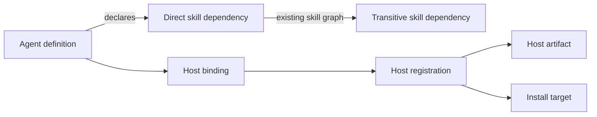

# カスタムエージェント配布基盤 再設計

## 文書の位置付け

この文書は、Agent Distribution にカスタムエージェントの生成、配布、導入、更新、削除、診断を追加するための設計正本である。従来このファイルに記載していた設計を置き換える。

対象読者は Agent Distribution の実装者とレビュー担当者である。個々のエージェントの成果責務やオーケストレーション手順は採用製品が所有し、この基盤では定めない。

この文書は、実装とテストが従う現在有効な契約を記載する。実装過程や置換前の構造は記録しない。

## 設計判断

1. ホストはモデル提供者ではなく、カスタムエージェントとスキルを読み込んで実行する製品を指す。
2. 初期対応ホストは Codex、Claude Code、GitHub Copilot の3製品とする。一つだけを前提に共通契約を決めない。
3. エージェントの意味はホスト非依存の定義と指示を正本とし、各ホストの構文と実行設定はホストバインディングへ分離する。
4. 配布依存は `Agent -> Skill` の一方向だけを許可する。スキルはエージェントに依存せず、エージェント同士の配布依存も作らない。
5. 依存関係の正本は構造化された `skillDependencies` だけとする。指示本文から依存を推定せず、本文へ特定ホストの参照構文を要求しない。
6. Skill と Agent は同じ実行ホスト識別子とホスト登録を共有する。ただし成果物形式が異なるため、成果物アダプターのインターフェースは無理に統合しない。
7. ホストの拡張点は一つのホスト登録境界に集約する。生成、依存解決、export、install、update、doctor、CLI へホスト別分岐を置かない。
8. コマンドルートは一つだけ構成する。Agent 用の第2ルートを公開設定として追加しない。
9. ファイルシステムの共通契約は MackySoft.FileSystem 0.2.1 を正本とし、Agent と Skill が独自実装を持たない。
10. スキル専用ソーススキーマ v1 は引き続き受理する。

## 用語

| 用語 | 意味 |
| --- | --- |
| 実行ホスト | Codex、Claude Code、GitHub Copilot のように、エージェントとスキルを探索して実行する製品 |
| モデル提供者 | OpenAI、Anthropic など、モデルを提供する主体。実行ホスト識別子には使わない |
| エージェント定義 | 名前、説明、ホスト非依存の指示、直接スキル依存から成る正本 |
| ホストバインディング | 一つのエージェントを特定ホスト向けに生成するための、ホスト固有設定 |
| ホスト成果物アダプター | ホストバインディングを検証し、ホストが読むファイルへ決定論的に変換する実装 |
| ホスト対象方針 | project/user scope の探索先、管理状態の配置、再読込み案内を表すホスト固有契約 |
| ホスト登録 | ホスト識別子、Skill アダプター、Agent 成果物アダプター、Agent 対象方針を対応付ける一つの登録 |
| 正規パッケージ | ソース定義から生成され、導入前の意味と digest を保持する配布単位 |
| 管理状態 | Agent Distribution が書いたファイル、導入時 digest、カタログ、対象を記録する状態 |

## 不変条件と依存方向



許可する依存は次だけである。

- Skill は同じカタログ内の Skill に依存できる。
- Agent は同じカタログ内の Skill に直接依存できる。
- Agent の操作は、直接依存を根として既存の Skill 依存グラフから推移的閉包を求める。

次の関係を表すスキーマ、ドメイン型、解決器は作らない。

- `Skill -> Agent`
- `Agent -> Agent`
- カタログ間依存
- 成果物種別を文字列で切り替える汎用 `ArtifactDependency`
- 任意依存、条件付き依存、個別バージョン制約

オーケストレーターが実行時に別のエージェントへ仕事を委譲することは配布依存ではない。複数エージェントを一括導入する要求が必要になった場合も、エージェント間依存ではなく明示的な選択集合として扱う。

## 共通ホスト識別子

Skill と Agent の内部ドメインは、一つの型付き語彙 `HostKind` を使用する。

| 値 | 正規文字列 | 指す製品 |
| --- | --- | --- |
| `Codex` | `codex` | Codex |
| `ClaudeCode` | `claude-code` | Claude Code |
| `GitHubCopilot` | `github-copilot` | GitHub Copilot |

`HostKind` は MackySoft.Text.Vocabularies の語彙 enum とする。ファイル名、JSON、CLI の境界でだけ正規文字列へ変換し、ドメイン内部で文字列比較しない。

OpenAI はモデル提供者であり実行ホストではないため、`OpenAi` という host kind や `openai` という host literal は定義しない。`SkillHostKind`、`AgentHostKind`、`openai`、`claude`、`copilot` からの変換層も置かない。CLI と JSON は `HostKind` の正規文字列だけを受け付け、旧文字列を拒否する。契約を隠すだけのオーバーロードは追加しない。

## 対応ホストの実契約

ホスト成果物は、2026-08-08 時点の各製品の公開仕様に従う。

| HostKind | ホスト成果物 | project scope | user scope | ホストが要求する中核 |
| --- | --- | --- | --- | --- |
| `codex` | `<agent-name>.toml` | `.codex/agents/` | `~/.codex/agents/` | `name`、`description`、`developer_instructions` |
| `claude-code` | `<agent-name>.md` | `.claude/agents/` | `~/.claude/agents/` | YAML frontmatter の `name`、`description` と Markdown 本文 |
| `github-copilot` | `<agent-name>.agent.md` | `.github/agents/` | `~/.copilot/agents/` | YAML frontmatter の `description` と Markdown 本文 |

根拠となる公開仕様は次である。

- [Codex custom agents](https://learn.chatgpt.com/docs/agent-configuration/subagents)
- [Claude Code subagents](https://code.claude.com/docs/en/sub-agents)
- [GitHub Copilot custom-agent configuration](https://docs.github.com/en/copilot/reference/custom-agents-configuration)
- [GitHub Copilot CLI custom agents](https://docs.github.com/en/copilot/how-tos/copilot-cli/customize-copilot/create-custom-agents-for-cli)

GitHub Copilot の project 成果物は公開 custom-agent contract を使う。初期 user scope は Copilot CLI の `~/.copilot/agents/` だけを対象とし、IDE 固有の user profile や organization/enterprise 配布は扱わない。

ホスト仕様は外部契約であり、将来変更され得る。各アダプターは対応する入力スキーマと出力 fixture の契約テストを持ち、仕様変更はアダプター単位の変更として取り込む。Agent Distribution はホスト仕様の未知の変更を推測して受け入れない。

### ホスト固有機能と配布依存を分ける

- Codex の `skills.config` は Codex のセッション設定である。
- Claude Code の `skills` はスキル本文を開始時コンテキストへ注入する設定である。
- GitHub Copilot の現在の custom-agent frontmatter には、Agent Distribution の配布依存に相当する共通フィールドはない。

これらを `skillDependencies` から自動生成しない。初期バインディングスキーマにも skill preload 設定を含めない。将来ホスト固有の preload を追加する場合は、配布依存とは異なる実行時効果として別途設計する。

## ソース定義

### バンドルレイアウト

ソーススキーマ v4 は次の固定レイアウトを使う。

```text
<bundle-root>/
  bundle.json
  skills/
    <category>/
      <skill-name>/
        skill.json
        SKILL.md.template
        references/
  agents/
    <agent-name>/
      agent.json
      AGENT.md.template
      hosts/
        codex.json
        claude-code.json
        github-copilot.json
```

`skills` と `agents` は、定義がある成果物種別だけ配置する。少なくとも一方に一つ以上の定義が必要である。Agent ごとに1つ以上のホストバインディングを要求するが、3ホストすべてを要求しない。バインディングファイルの存在が、その Agent が当該ホストをサポートする宣言になる。source root は `bundle.json`、`skills`、`agents` だけを許可する。

Agent 名は全 Agent 間で一意な lower-kebab とする。この制約は Claude Code の必須命名規則を満たし、Codex と GitHub Copilot でも安定したファイル名と識別子として利用できる。

### `bundle.json`

```json
{
  "schemaVersion": 4,
  "catalogId": "com.example.agent-assets",
  "bundleVersion": 1
}
```

`bundleVersion` は Skill と Agent を含む一つのカタログ版である。v1 の `skillBundleVersion` は既存スキル専用契約として意味を変えない。

### `agent.json`

```json
{
  "schemaVersion": 1,
  "displayName": "Architect",
  "description": "Creates an implementation-ready design.",
  "skillDependencies": [
    "claim-grounding"
  ]
}
```

| フィールド | 契約 |
| --- | --- |
| `schemaVersion` | Agent ソース定義の版。初期値は `1` |
| `displayName` | 一覧と操作報告に使う表示名 |
| `description` | ホストが委譲判断に利用できるホスト非依存の説明 |
| `skillDependencies` | 同じカタログ内で直接要求する Skill 名 |

Agent 名は `agents` 直下のディレクトリ名から導出する。モデル、モデル提供者、推論強度、権限、ツール、ホスト識別子、導入先を `agent.json` に置かない。

### `AGENT.md.template`

`AGENT.md.template` はホスト非依存の指示本文であり、次を記述できる。

- 担う成果責務
- 必要な入力と開始条件
- 判断と作用の境界
- 成果物と完了条件
- 完了できない場合の報告

次は記述しない。

- `$skill-name` など、特定ホストやクライアントのスキル呼出し構文
- `skills:`、`skills.config`、ホストの tool 名
- TOML や YAML の設定断片
- 特定の探索パスや再読込み手順
- 特定モデルだけに依存する指示

本文で Skill 名を自然言語として説明することはできるが、Foundation は本文を走査せず、依存宣言との一致も要求しない。

### 依存宣言の検証

`skillDependencies` に対してだけ次を検証する。

- 同じカタログに Skill が存在する。
- Agent 自身の配列に重複がない。
- 各名前が既存の Skill 名契約を満たす。
- 直接依存を根とする既存 Skill グラフが欠落や循環なく解決できる。

宣言した Skill が本文に現れないこと、本文に同名の語が現れること、`$` があることは検証対象ではない。

## ホストバインディング

`hosts/<host-kind>.json` は、ホスト固有設定だけを持つ。共通の可変 dictionary や、全ホストの設定を詰め込む union schema は作らない。各アダプターが自分の versioned schema を読み、未知のフィールドと未対応値を拒否する。入力 JSON のプロパティ順は意味に含めず、生成時だけ正規順序へ整える。

初期スキーマが扱う範囲は次とする。記載のないホスト機能は初期実装へ含めない。

| バインディング | 初期フィールド |
| --- | --- |
| `codex.json` | `schemaVersion`、`model`、`reasoningEffort`、`sandboxMode` |
| `claude-code.json` | `schemaVersion`、`model`、`tools`、`disallowedTools`、`permissionMode`、`maxTurns` |
| `github-copilot.json` | `schemaVersion`、`target`、`tools`、`model`、`disableModelInvocation`、`userInvocable` |

`schemaVersion` 以外は省略可能とし、省略時はホストの継承または既定動作を使う。アダプターは値が明示された場合だけホスト成果物へ出力する。初期スキーマは `modelProvider` を公開せず、ホスト識別子をモデル提供者から導出しない。Codex の代替 model provider など具体的な要求が生じた場合は、Codex binding の追加フィールドとして設計する。

GitHub Copilot の `tools` は、省略時に全ツールを継承し、空配列を指定した場合は全ツールを無効にする。両者を同一状態へ正規化しない。

Codex バインディングを持つ Agent は、Codex の組込み名 `default`、`worker`、`explorer` を使用できない。

## ホスト登録と拡張点

### 一つの登録境界

一つの `HostRegistration` は次を対応付ける。

| 登録要素 | 責務 |
| --- | --- |
| `HostKind` | 登録の唯一の識別子 |
| Skill host adapter | Skill の materialization と Skill 対象方針 |
| Agent artifact adapter | Agent binding の検証とホスト成果物の生成 |
| Agent target policy | project/user の Agent 探索先、管理状態の安全な配置、再読込み案内 |

アダプター自身に重複した `HostId` を持たせない。登録キーを正本にし、起動時に重複登録と必要構成の欠落を検証する。

`HostRegistration` は公開サービスや依存性注入の契約ではない。閉じた `HostKind` ごとに完全な組込みモジュールを一度だけ構成し、内部のホスト境界で参照する対応表である。Source reader、package generator、materialization、target resolver は型付き `HostKind` を渡し、ホスト成果物または対象方針が必要になった境界だけで対応する登録を取得する。dependency resolver、export、install、update、uninstall、prune、doctor、CLI runner にホスト別 switch や文字列照合を置かない。

### Agent artifact adapter の責務

Agent artifact adapter が所有するのは次だけである。

- 自分の binding JSON の解析と検証
- Agent 名、description、ホスト非依存指示、binding からの決定論的なファイル生成
- ホスト固有の名前制約と、明示された組込み名上書きの検証
- 安全な相対パスと内容から成る成果物集合の返却

次は共通基盤に残す。

- Skill 依存解決
- 対象ルートの物理安全性
- 管理状態の形式
- managed/unmanaged/foreign/local-modified の分類
- file diff、dry-run、force、操作計画
- 原子的な単一ファイル公開
- 複数成果物をまたぐ操作報告

これにより、アダプターを導入・状態管理・衝突判定まで抱える巨大なクラスにしない。

### 初期アダプター

| アダプター | 正規指示の配置 | 主な設定変換 |
| --- | --- | --- |
| Codex | TOML の `developer_instructions` | `model_reasoning_effort`、`sandbox_mode` など |
| Claude Code | YAML frontmatter 後の Markdown 本文 | `model`、`tools`、`permissionMode` など |
| GitHub Copilot | YAML frontmatter 後の Markdown 本文 | `target`、`tools`、`model` など |

新しい組込みホストを追加する場合に変更してよい範囲は、`HostKind` の語彙、当該ホストモジュール、組込み登録の構成、当該ホストの契約テストである。共通の reader、generator、依存解決、配布サービス、導入サービス、CLI runner を変更する必要があれば、拡張点が成立していない。

第三者アセンブリから任意ホストを登録する public plugin API は初期要件に含めない。必要になった時点で、識別子を開いた値型にすること、API versioning、信頼境界を別途設計する。

## 生成パッケージ

### 生成レイアウト

```text
<output-root>/agent-distribution/
  bundle.json
  skills/
    <skill-name>/
      ...
  agents/
    <agent-name>/
      agent-manifest.json
      AGENT.md
      hosts/
        codex/
          <agent-name>.toml
        claude-code/
          <agent-name>.md
        github-copilot/
          <agent-name>.agent.md
```

`AGENT.md` は正規化したホスト非依存指示であり、ホストが直接探索するファイルではない。`hosts/*` だけがホスト成果物である。ソースに binding があるホストだけ生成する。

### Agent manifest

`agent-manifest.json` は次を持つ。

- `schemaVersion`、`catalogId`、`bundleVersion`
- Agent 名、`displayName`、`description`
- 直接の `skillDependencies`
- 正規 `AGENT.md` の digest
- manifest 自身の digest
- host kind ごとの成果物相対パスと digest

推移的 Skill 依存、ソースパス、生成時刻、ツール版、Git commit、導入先、再読込み案内は保存しない。

### Build

`agent-distribution build --source <source-root> --output <output-root>/agent-distribution` は一つのカタログ全体を次の順で処理する。

1. ソーススキーマを選択する。
2. 全 Skill と Agent の構造、名前、メタデータを読む。
3. Skill グラフと Agent の直接 Skill 依存を検証する。
4. binding の host kind から組込みホスト登録を解決する。
5. 各 adapter で binding を検証し、host artifacts を生成する。
6. manifest と bundle digest を決定論的に計算する。
7. 完成した生成ルート全体を検証する。
8. 指定した output の `agent-distribution` と異なる場合だけ置き換える。

検証または生成が一件でも失敗した場合、ソースと output を変更しない。`--check` は同じ処理を行い、書込みだけを禁止する。repository は output を `artifacts/agent-distribution` に生成し、Git で追跡しない。package 作成前に別プロセスで output を生成し、NuGet package 内では従来どおり `agent-distribution/` に配置する。

## 配布と導入

### Agent 操作

Agent の export/install/update/doctor は、選択 Agent と host kind から一つの `HostRegistration` を取得する。同じ登録の Skill adapter を使って、Agent の直接依存と推移的 Skill 依存を同じホストへ materialize する。Agent host と Skill host を文字列一致で接続しない。

書込み前に次を一つの計画へ確定する。

- 選択 Agent
- 直接依存と推移的 Skill 閉包
- Agent と Skill の対象ルート
- 既存管理状態と file digest
- unmanaged、foreign catalog、local modification、予約名、パス衝突
- 実行する作成、更新、削除

`uninstall` と `prune` は選択 Agent だけを削除し、Skill を削除しない。初期実装では依存元の参照数を永続化しないため、不要な Skill の削除は既存 Skill コマンドで明示する。

Agent と Skill の2対象ルートをまたぐ完全な transaction と rollback は初期範囲に含めない。各ファイルは原子的に公開し、結果は完了項目と未完了項目を区別し、再実行で目標状態へ収束できるようにする。

### コマンド構成

組込み先の実行ファイル名と command root は製品が所有する。Agent Distribution の ConsoleAppFramework 統合は、固定 token `skills` と `agents` を製品の command root 直下へ同格な resource group として登録する。

```text
skills list|export|install|update|uninstall|prune|doctor
agents list|export|install|update|uninstall|prune|doctor
```

単独 CLI は次になる。

```text
agent-distribution skills list
agent-distribution agents list
agent-distribution build
```

ConsoleAppFramework 統合では `RegisterAgentDistributionCommands()` が両 resource group を登録する。単独 CLI の実行ファイル名 `agent-distribution` や製品側の実行ファイル名を、登録 token や runtime 設定として扱わない。

`build` はソースを所有する単独 CLI の生成コマンドであり、組込み先製品の runtime command tree へ自動登録しない。

### Agent command の入力

| 入力 | 契約 |
| --- | --- |
| `--agent` | Agent 名を選択する。`list` では省略して全 Agent を列挙できる |
| `--host` | `codex`、`claude-code`、`github-copilot` のいずれか |
| `--scope`、`--repository-root` | host target policy が project/user の既定対象を解決するために使う |
| `--agent-target-dir` | Agent 成果物の対象だけを明示的に上書きする |
| `--skill-target-dir` | 依存 Skill の対象だけを明示的に上書きする |
| `--dry-run`、`--force`、`--print-diff` | 既存 Skill 操作と同じ意味の共通 planning 契約を使う |

`list` は host を要求せず、各 Agent の対応 host と直接 Skill 依存を報告する。export/install/update/doctor は選択 host の binding がない Agent を書込み前に拒否する。uninstall/prune は現在の管理状態を対象にし、依存 Skill を削除しない。

## Skill と Agent の共通基盤

共通化する対象は、名前が似ている処理ではなく、不変条件と失敗条件が同じ処理に限る。

| 共通基盤へ置く | 成果物固有として残す |
| --- | --- |
| `HostKind` と組込み `HostRegistration` | Skill/Agent の source schema |
| package 相対パスと対象 containment | Skill/Agent の manifest field |
| digest、deterministic serialization の原則 | Skill dependency と Agent direct dependency の読取り |
| managed file set、diff、action、drift の基本型 | Skill frontmatter と Agent host artifact の生成 |
| dry-run、force、operation report の共通分類 | 各ホスト成果物の serializer |
| managed state、diff、operation report の共通表現 | 製品固有の target layout と reload guidance |

Skill サービスをそのまま複製した `Agent*` サービスを作らず、共有できる reconciliation、state、path、filesystem、report の primitive を一つだけ持つ。一方、Skill と Agent を `ArtifactKind` で切り替える巨大な汎用 package manager も作らない。

## MackySoft.FileSystem 0.2.1 との境界

`MackySoft.FileSystem` と `MackySoft.FileSystem.Physical` は同じ厳密バージョン `[0.2.1]` を参照する。

| 契約 | 正本 |
| --- | --- |
| 絶対パス、root-relative path、字句 containment | `AbsolutePath`、`RootRelativePath`、`ContainedPath` |
| 型付きパスの等価性 | `AbsolutePath.IsSameAs`、`RootRelativePath.IsSameAs`、`ContainedPath.HasSameBoundaryAndTargetAs` |
| final entry のリンク非追従観測 | `FileSystemEntryInspector` |
| 明示的な link/missing-tail policy と物理 containment snapshot | `PhysicalPathResolver` |
| 同一ディレクトリ一時ファイルによる単一ファイル公開 | `AtomicFilePublisher` |

Agent Distribution はこれらと同じ責務の helper、platform 分岐、symlink 検査、atomic publish を再実装しない。

Foundation の resolution は操作時点の snapshot であり、永続的な安全 proof ではない。書込み直前の再検証、複数ファイル transaction、locking、access-control policy、製品固有の診断文言は Agent Distribution が所有する。

## 管理状態と安全性

- 管理状態の schema と drift 判定は共通基盤が所有する。
- host target policy は、ホストが探索しない管理領域を解決する。
- 同じカタログが管理し、導入時から変更されていないファイルだけを通常更新・削除できる。
- `--force` は同じカタログのローカル変更だけに適用できる。
- unmanaged、foreign catalog、unsafe path、symlink/reparse point、予約名の不許可は `--force` でも解除しない。
- adapter が返す相対パス、複数 Agent 間の出力衝突、target 外解決を計画時と書込み直前に検証する。
- Foundation の snapshot 自体を管理状態へ保存して所有証明にしない。

## 継続する既存契約

- ソーススキーマ v1 とその生成物は、Skill 専用レイアウトとして読む。
- v4 は `skills` と `agents` を明示し、ディレクトリの有無から version を推定しない。
- Skill コマンドは既存の位置と意味を変えない。
- v4 Agent source、manifest、operation report は `codex`、`claude-code`、`github-copilot` を正規値にする。
- 現在の skills-pack `feat/agent-orchestration-foundation` にある `.codex/agents/*.toml` は、エージェント責務を検討する作業配置であり、Codex 固有の配布設計を正本化するものではない。

## 非目標

- Agent 間のオーケストレーション規則
- 複数 Agent を束ねる導入 profile や role set
- カタログ間依存
- ホスト共有設定ファイルの部分編集
- 第三者 host plugin の公開 ABI
- Claude Code plugin package や GitHub organization-level agent 配布
- host-native skill preload の自動生成
- 複数対象ルートをまたぐ rollback

## 受け入れ条件

- `AGENT.md.template` と `agent.json` にホスト固有構文やモデル提供者がない。
- `skillDependencies` だけから直接依存と既存 Skill の推移的閉包を解決できる。
- `Skill -> Agent` と `Agent -> Agent` を表す公開経路がない。
- Codex、Claude Code、GitHub Copilot の3 adapter が、同じホスト非依存定義から各公式形式を生成できる。
- 各 Agent は1つ以上の任意の host binding を持て、未指定ホストの追加を要求されない。
- Skill と Agent が共通 `HostKind` と一つの host registration を使い、文字列照合で接続されていない。
- 新しい組込みホストの追加で、reader、dependency resolver、distribution、installation、CLI runner を変更しない。
- 公開 command root が一つで、Agent command path がそこから一意に導出される。
- managed file set、state、diff、planning、filesystem の同一契約が Skill と Agent で重複していない。
- MackySoft.FileSystem 0.2.1 の typed equality、inspector、resolver、publisher と同じ処理を独自所有していない。
- v1 Skill bundle を読め、Skill command の位置と意味が変わらない。
- 同じ入力から生成される package、manifest、host artifacts、zip が byte-identical である。
- build、export、install、update、uninstall、prune、doctor の失敗が書込み前に分類され、再実行可能な結果を返す。
